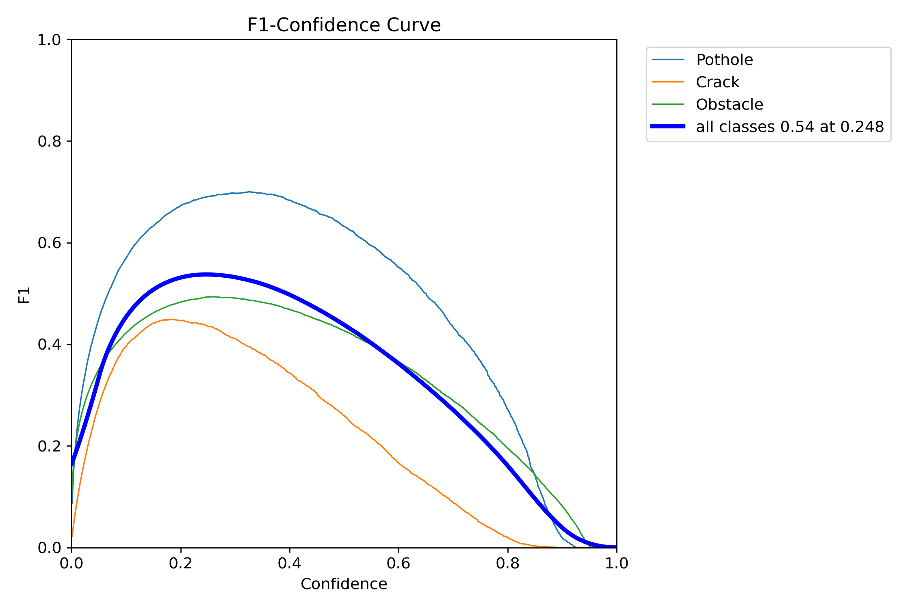
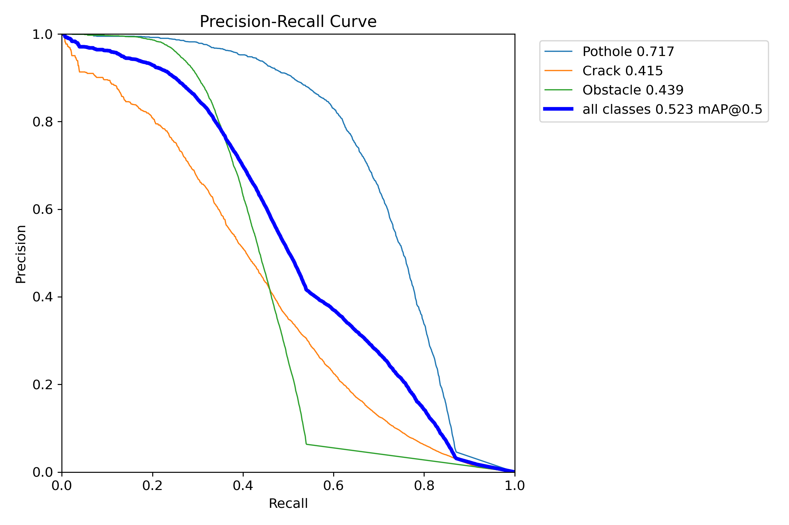
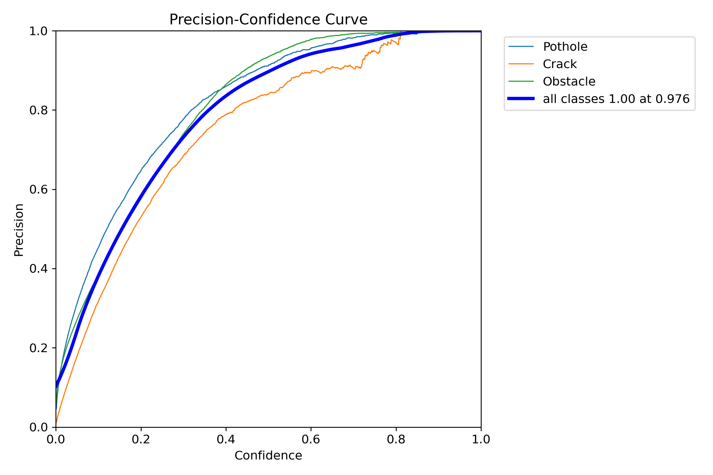
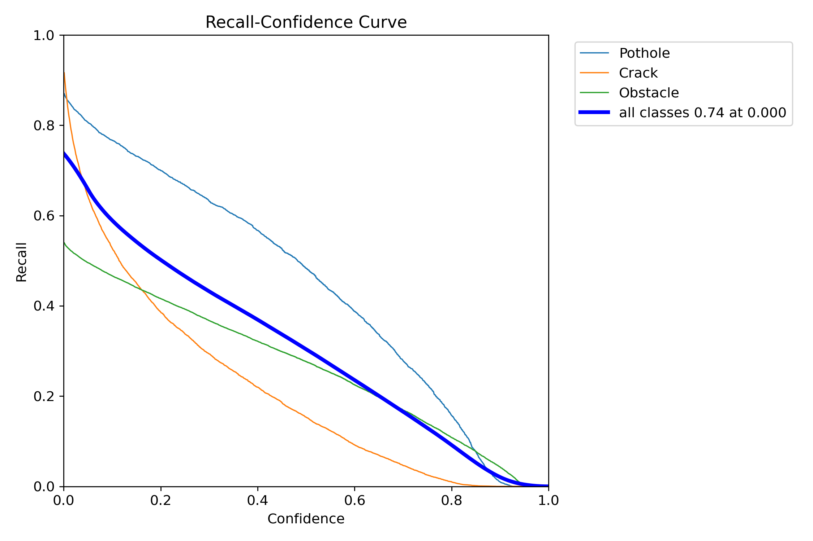
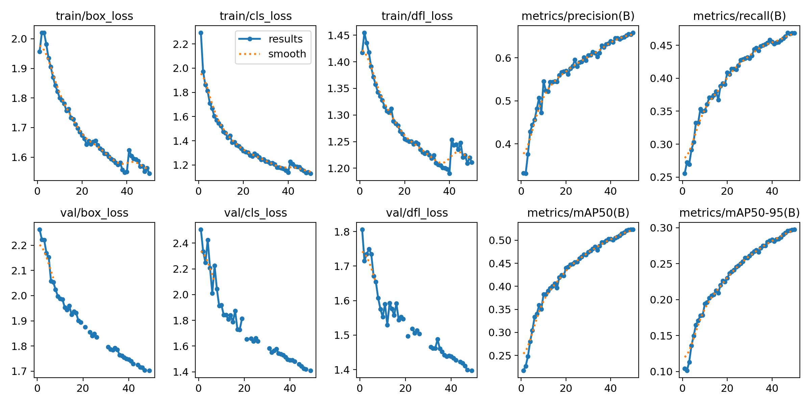
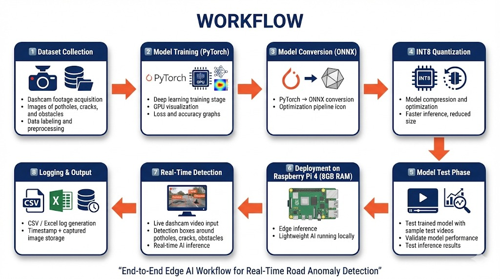

# 🚗 Edge AI Road Anomaly Detection

<p align="center">
  
  
  
  
  
</p>

---

## 🏆 🏆 Edge AI Deployment Project

<p align="center">
<b>Data → YOLOv8 Nano → ONNX → Edge AI Deployment</b>
</p>

---


## 🔗 Quick Access

- 📁 **Dataset:** [Google Drive Link]
- 📊 **PPT / Documentation:** [Google Drive Link]
- 🧠 **ONNX Model:** [Drive Download Link]
- 📂 **Complete Project Folder:** [Full Access Drive Link]
- 🎥 **Full Demo Presentation (Project Explanation + Live Run)**  
▶️ [Watch Demo Video](https://drive.google.com/drive/folders/1rJ325TF-5vxMDhW4gcm3hYMPu8KR3XgR?usp=sharing)

📹 **Sample Model Output (Real-Time Detection on ARM Device)**  
▶️ [Watch Sample Output]([https://your-sample-link-here](https://drive.google.com/drive/folders/1-y20-uwxIQUpwHqq6mW28EHFbjHHxk9l?usp=sharing))


---

## 📂 Repository Sections

- 📦 `models/` → ONNX & INT8 Model Files  
- 📝 `logs/` → Sample CSV Detection Logs  
- 🎥 `demo_video/` → Final Demo Output  
- 🎬 `sample_predictions/` → Model Predictions on Sample Footage  
- ⚙ `inference.py` → ONNX Runtime Inference Script  

---
## 📌 Overview

This project presents a real-time **Edge AI-based Road Anomaly Detection System** designed for on-device execution using Raspberry Pi 4 (CPU-only).

The system primarily detects:

- 🕳 Potholes  
- 🪨 Cracks  
- 🚧 Unexpected Obstacles (Animals, Autorickshaws, Riders)  

The model is built using YOLOv8 Nano and optimized for efficient edge inference using ONNX and INT8 quantization.

### 🔹 Key Highlights

- Real-time inference on Raspberry Pi 4
- ONNX-based CPU acceleration
- INT8 quantized model for reduced computation
- 320×320 optimized inference resolution
- Persistent CSV logging of detections
- Fully offline edge deployment
- No GPU required during inference
- Lightweight model suitable for ARM processors

The system enables practical on-device anomaly detection suitable for real-world unstructured road environments.

---

## 🎯 Problem Understanding

Real-world road environments are highly unstructured and unpredictable. Surface defects such as potholes and cracks, along with unexpected obstacles like animals and irregular vehicles, pose significant safety risks.

Deploying real-time detection on embedded platforms such as Raspberry Pi introduces key constraints:

- Limited computational resources (CPU-only execution)
- Need for ≥5 FPS near-real-time inference
- Reduced false positives in detection logs
- Robustness under varying lighting conditions

The challenge is to design an optimized edge AI system that performs accurate, real-time anomaly detection directly on-device without GPU acceleration.

This project addresses these constraints using a lightweight YOLOv8 Nano model, ONNX Runtime deployment, INT8 quantization, and an efficient OpenCV-based inference pipeline.

---

## 🧠 Model Development

### Model Selection

A lightweight YOLOv8 Nano architecture was selected due to:

- Small model size
- Fast inference speed
- Single-stage detection
- Suitability for CPU-only edge deployment

---

## 🧠 Training Configuration

| Parameter | Value |
|------------|--------|
| Model | YOLOv8 Nano |
| Framework | Ultralytics (PyTorch) |
| Epochs | 50 |
| Training Image Size | 320 × 320 |
| Deployment Image Size | 320 × 320 |
| Batch Size | 16 (default) |
| Optimizer | SGD / Adam (Ultralytics default) |
| Pretrained Weights | yolov8n.pt |
| Quantization | INT8 (ONNX Export) |
| Inference Backend | ONNX Runtime |
| Deployment Device | Raspberry Pi 4 (CPU-only) |

---

### 🔧 Training Strategy

- Reduced input resolution (320×320) for faster edge inference  
- Lightweight single-stage detection architecture  
- Exported to ONNX for ARM CPU compatibility  
- INT8 quantization to reduce computation and model size  

---

## 📊 Model Evaluation Dashboard

| F1 Score | Precision–Recall Curve |
|----------|------------------------|
|  |  |

---

| Precision–Confidence | Recall–Confidence |
|----------------------|------------------|
|  |  |

---

### 📈 Training Summary

<p align="center">
  
</p>

## 🏗 Proposed System Architecture

<p align="center">
  
</p>

### 🏗 Architecture Description

The proposed architecture consists of two major stages: Model Development and Edge Deployment.

1. **Dataset Preparation**  
   Road images containing potholes, cracks, and obstacles are collected and annotated.

2. **Model Training (YOLOv8 Nano)**  
   A lightweight YOLOv8 Nano detector is trained using 320×320 input resolution for efficient edge inference.

3. **Model Optimization**  
   The trained PyTorch model is exported to ONNX format and quantized to INT8 for reduced computational complexity.

4. **Edge Inference (Raspberry Pi 4)**  
   The optimized ONNX model is deployed using ONNX Runtime on Raspberry Pi (CPU-only execution).

5. **Real-Time Detection & Logging**  
   Dashcam input is processed frame-by-frame, detections are drawn, and anomalies are logged with timestamps.

The architecture is designed for efficient, CPU-only real-time deployment on Raspberry Pi.

---

## 🔄 End-to-End Workflow

<p align="center">
  
</p>

### 🔄 Workflow Explanation

The system follows an end-to-end pipeline from training to deployment:

1. **Data Collection & Annotation**  
   Road footage is annotated for potholes, cracks, and unexpected obstacles.

2. **Model Training & Validation**  
   YOLOv8 Nano is fine-tuned for 50 epochs and evaluated using precision, recall, and mAP metrics.

3. **ONNX Conversion & INT8 Quantization**  
   The trained model is exported to ONNX and quantized to INT8 for optimized CPU inference.

4. **Deployment on Raspberry Pi 4**  
   ONNX Runtime executes the model using ARM-based CPU without GPU acceleration.

5. **Real-Time Video Processing**  
   OpenCV captures video frames, performs inference, applies threshold filtering, and logs detections to CSV.

6. **Output Generation**  
   - Bounding boxes displayed on video  
   - Timestamped anomaly logs  
   - Optional saved detection frames  

This structured workflow enables seamless transition from training environment to real-world edge deployment.

---


## ⚡ Why ONNX?

ONNX (Open Neural Network Exchange) was selected as the deployment format to enable efficient and hardware‑agnostic edge inference on Raspberry Pi.

### Key Reasons for Choosing ONNX:

- 🚀 Faster inference compared to native PyTorch execution
- ⚙ Reduced Python runtime overhead
- 🔁 Cross-platform compatibility (ARM, x86, embedded devices)
- 🧠 Optimized execution using ONNX Runtime
- 📦 Smaller deployment footprint
- 🔄 Seamless integration with quantization workflows

For edge deployment on Raspberry Pi 4 (CPU-only), ONNX provides a lightweight and optimized inference engine that improves execution speed and stability compared to running full PyTorch models.

---

## 🔢 Why INT8 Quantization?

To achieve real-time performance on ARM-based CPUs, INT8 quantization was applied during ONNX export.

### Benefits of INT8 Quantization:

- 📉 Reduced model size
- ⚡ Faster inference on CPU
- 🧮 Lower memory usage
- 🔋 Reduced computational cost
- 🖥 Better performance on Raspberry Pi without GPU

Quantization converts 32-bit floating-point weights (FP32) into 8-bit integers (INT8), significantly reducing arithmetic complexity while maintaining acceptable detection accuracy.

This trade-off enables the system to meet the ≥5 FPS requirement on Raspberry Pi 4 while maintaining reliable anomaly detection performance.

---

## 🖥 Deployment Performance

The optimized ONNX INT8 model was evaluated across multiple platforms to validate real-time edge inference capability.

| Device | Inference Speed (FPS) |
|--------|------------------------|
| NVIDIA RTX 3050 (Training) | 50+ FPS |
| Laptop CPU | 20-25 FPS |
| Raspberry Pi 4 (CPU-only) | 6–8 FPS |

### ✅ Key Advantages

- Reduced false-positive logging through confidence threshold tuning (0.25)
- Balanced precision and recall using F1 optimization
- Stable detection under real-time CPU-only constraints
- Lightweight deployment without external accelerators

By optimizing the confidence threshold and applying bounding box filtering, the system minimizes unnecessary anomaly logs, ensuring reliable and meaningful detection records.

- Deployment Resolution: **320 × 320**
- Inference Backend: **ONNX Runtime**
- Execution Mode: **CPU-only**
- Confidence Threshold: **0.25**

The system successfully satisfies the ≥5 FPS near-real-time requirement for Raspberry Pi deployment under CPU-only constraints.

---

## 💻 Hardware

### Development Environment
- NVIDIA RTX 3050 (Training Phase)
- Python (Ultralytics YOLOv8)
- VS Code

### Deployment Environment
- Raspberry Pi 4 (Primary Edge Device)
- USB Webcam (Dashcam Input)
- CPU-only inference (No GPU / No accelerator)
- Raspberry Pi OS
- High-speed microSD card

The deployment setup aligns with embedded ARM-based edge-computing requirements and satisfies the CPU-only constraint specified in the challenge.

---

## 📊 CSV Logging Format

Each detected anomaly is persistently logged in CSV format with timestamp and confidence score for post-analysis.

### Log Format

| Timestamp | Class | Confidence | Image Saved |
|------------|--------|------------|-------------|

### Example Entry

```
2026-02-18 10:34:12 | Pothole | 0.87 | pothole_034.jpg
```

This logging mechanism ensures traceability of detected road anomalies during inference.

---

## ▶ How to Run

### 1️⃣ Install Dependencies

```bash
pip install -r requirements.txt
```

### 2️⃣ Run Inference

```bash
python inference.py
```

The system will:
- Capture dashcam input
- Perform ONNX INT8 inference
- Apply confidence filtering
- Draw bounding boxes
- Log detections to CSV
- Display real-time output

---

## 🌟 Project Advantages

- ✅ Real-time CPU-only inference on Raspberry Pi 4
- ✅ Meets ≥5 FPS requirement
- ✅ Reduced false logging through optimized confidence threshold
- ✅ Lightweight INT8 quantized model
- ✅ Organized CSV-based anomaly tracking
- ✅ No external AI accelerator required
- ✅ Cross-platform deployment using ONNX

The system prioritizes reliability by reducing false detections while maintaining acceptable detection accuracy for edge deployment.

---

## 🔮 Limitations & Future Work

- Current mAP@0.5 ≈ 0.523; performance can improve with expanded dataset and class balancing.
- FPS may vary under extreme lighting conditions.
- Further optimization through pruning or mixed precision could increase inference speed.
- Additional anomaly classes can be incorporated in future versions.
- Integration with alert systems could enable real-time driver notifications.

 ---


## 📜 Conclusion

This project demonstrates that real-time road hazard detection can be achieved on affordable embedded hardware using intelligent optimization techniques rather than expensive GPU infrastructure.

It provides a scalable and practical solution for unstructured road environments.
